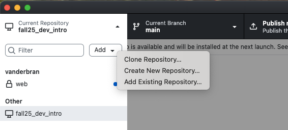

# fall25_dev_intro

Good afternoon everyone! Welcome to the introductory repository for CSC2510. 

This is an example of a README file - you're used to reading my assignment pages in Markdown, so you'll be experts at writing these! 

## To-Do 

1. I want you all to clone this repo to your local machine. You can accomplish this through the GUI by copying the URL (at the top of the page), and press the *Clone Repository* button.  
    a. Another way to accomplish this is CLI Git, running `git clone {url}`

2. Next, I want you all to change something in either the CSS or HTML. Add your name, change the colors, whatever you feel like. 

